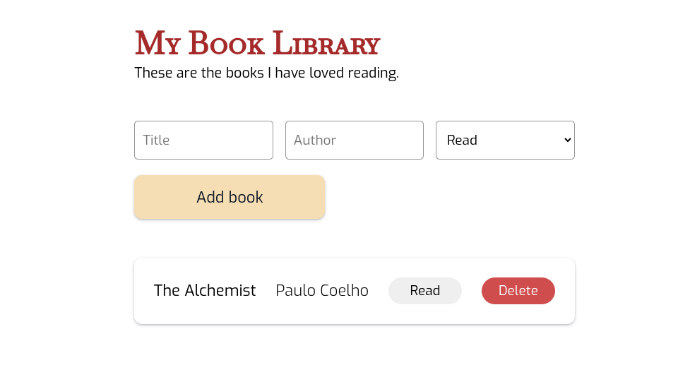

# Library App
## Live Preview <a href="https://afnsami.github.io/library-app">HERE</a>

This time I had to make a library app from scratch

The part where it felt the most difficult  is when I had to render each book object when user presses AddBook button.

Also when to delete the book div when user clicks delete button in the bookCard.

It took me around<b> 2 months</b>. It is longer than usual. Mainly because I was busy with other things in life.

I am glad I finished it. I have to learn more and with more seriousness.

